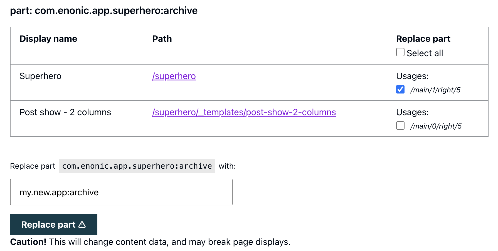
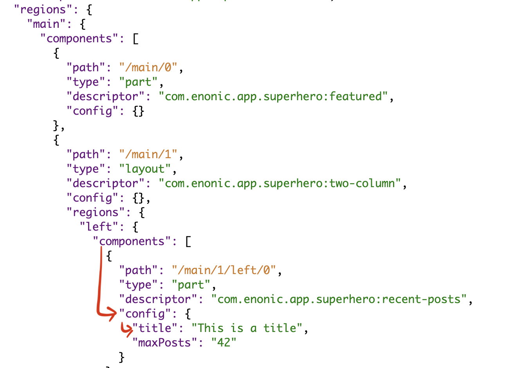
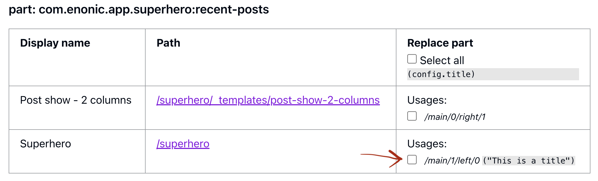
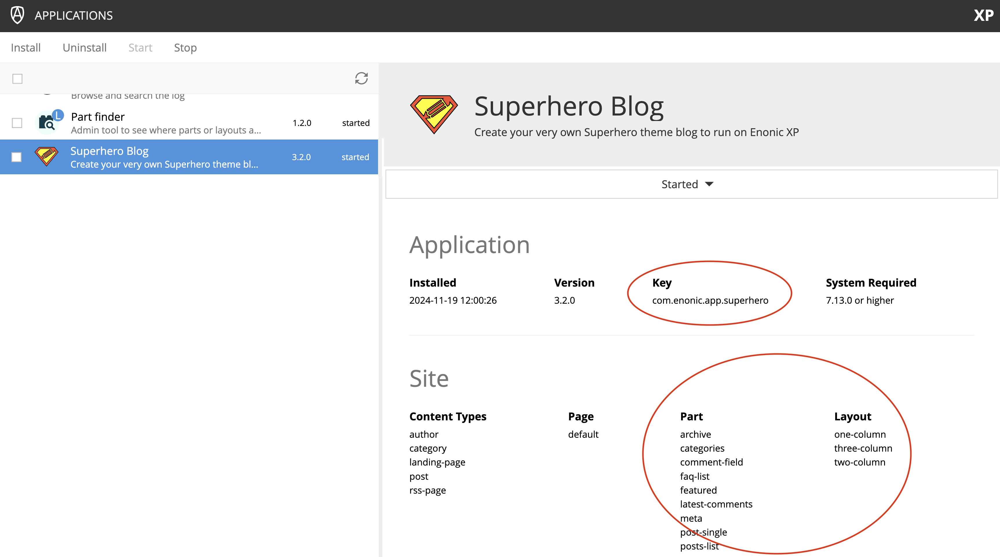

# Part Finder

When you are working on an XP-part – you might want to know all the content where it's being used. This app provides an
admin tool that lists usage of your components (parts, layouts, pages) to help you with testing and configuration.

[](https://repo.itemtest.no/#/releases/no/item/xp-part-finder)


## Setup

Install npm-dependencies

```bash
npm install
```

To prepare the Storybook-environment you need to create a _.env_ file. The easiest way is to copy over the existing
_.env_example_ file.

```bash
cp .env_example .env
```

> [!IMPORTANT]
> Make sure `STORYBOOK_SERVER_URL` in _.env_ matches a valid service path in **your** local XP setup.

## Running storybook

To make development easier and quicker, pages, layouts, parts and Freemarker-macros have Storybook-stories that let us
get immediate feedback when developing.

To be able to run Storybook locally you need to install [xp-storybook](https://github.com/ItemConsulting/xp-storybook)
in your local sandbox. When it is installed, you can run storybook locally with the following command:

```bash
npm run storybook
```

## Building

To build the project, run the following command

```bash
enonic project build
```

You will find the jar-file at _./build/libs/item.jar_

## Deploying locally

To deploy to a local sandbox, run the following command

```bash
enonic project deploy
```

## Deploy to Maven

```bash
./gradlew publish -P com.enonic.xp.app.production=true
```

## Part mover

This app can also "move parts" - ie. replace the keys in content items that point to which parts or layouts the content
uses so an existing content uses that new part instead. Which parts/layouts to replace can be selected on a single- or
multiple-instance basis, and/or by batch, using a GUI.

For example, this makes it possible to replace the part `com.enonic.app.superhero:featured` (the `featured` part in
the `com.enonic.app.superhero` app) with the part `my.new.app:featured` (same part but now from another app), and only
on the 4th and 5th usage instance of the part, in one particular content - in one operation.

### Using the part mover

Don't miss the <a href="#caution"><span style="color:red">"Caution"</span></a> section after the overview!

#### Enabling the GUI

The part mover GUI is hidden by design, for safety. To see it, add a `replace` parameter to the URL - in practice:
`&replace=true`. This only works for parts and layouts currently (pages may be added later, it just hasn't been tested
enough).

#### Moving parts (or layouts)

The GUI adds a third right column for the displayed parts, where each usage of that part in each content is marked -
with the _path_ of where the part is used in that content. There's also a checkbox for each usage (and a "select all"
checkbox in the title row, checking all the boxes below).


<br />
<br />

Use the checkbox to select which usages to replace (with _one_ new part key at a time. To replace with different new
parts, repeat the operation for each new one). At the bottom, below the table, input the new key in the text field.

After the operation is complete, a summary screen is displayed: usually a green checkmark for successful operation, or a
red cross for an error. It's also possible to select single contents or usage instances and undo them.

#### Data peeking and filtering

Sometimes, picking which instances to move, depends on the part config of each part. To make bulk selection easier, add
a `getvalue` parameter to the URL, where the value is the path to a single data field, relative to part's data root.

For example, use [Content Viewer](https://market.enonic.com/vendors/enonic/com.enonic.app.contentviewer) to look up a
path `config.title`...


<br />
<br />

...and add `&getvalue=config.title` to part-finder's URL to display it in the replace-checkbox column:


<br />
<br />

By adding a particular value to the parameter (eg. `&getvalue=config.title="This is a title"`), only usage items where
the value matches, will have a checkbox - allowing batch operations on only selected values.

### Caution!

Some notes to move parts more safely:

- Obviously, __do a backup first__. For example,
  use [Data Toolbox](https://market.enonic.com/vendors/glenn-ricaud/data-toolbox) to make an export of the contents
  you're about to change.
- __Take care to spell the new key correctly and with the full name__. The "Replace part" button is enabled when at
  least one part usage has its checkbox selected and a new app:part key is input with the correct format (for
  example: `com.enonic.app.superhero:archive`). But that just checks the format, there's no check (yet) for whether the
  new part name actually exists in any app. If unsure, use the app-key and part/layout in Enonic's Application admin
  tool:

  
  <br />
  <br />

  If you do accidentally misspell the part name so it no longer matches any `app:name` found on any of the apps, it's
  likely created an error in the content node that will break the display of that content. Do a manual fix or revert to
  a backup.

- It's recommended that the new part is implemented with a __data schema that's as similar as possible to the original__. A part replacement makes no other changes with existing data: part config data etc won't be adapted to the new
  implementation. Review the new part descriptor and controller.

- __Use the summary/undo page__: click the links and check each content to verify the operation (links open in new tab).
  Can check results and undo if necessary: revert to the old part name on selected usage instances. When closing this
  screen/navigating away, the undo opportunity is lost (and that includes any items that weren't selected for undo, 
  when using the undo function).

- Known bug: __the undo function on _error items_ doesn't work perfectly__. On errors (marked with a red cross icon ❌),
  it's recommended to revert a backup instead.

